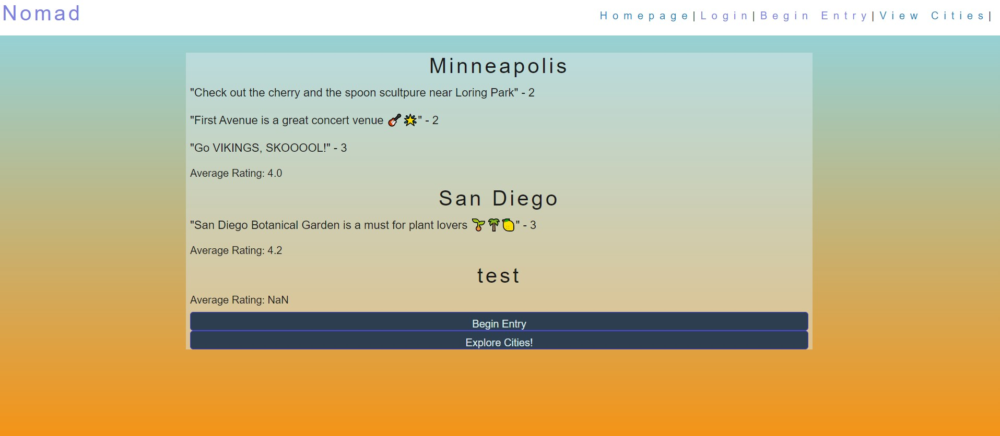

# Nomad

## Description

This application can be used to connect users that have opinions about cities! Users can rate a given city based on the following categories: night life, affodability, dining, transporataion, activities, and family friendliness. The rating will be out of 5 stars with 5 being the highest rating 🤩. 

## Table of Contents

- [Installation](#installation)

- [Usage](#usage)

- [Contributing](#contributing)

- [Questions](#questions)

## Installation

1. Go to root directory
2. npm init -y
3. Type in the terminal the following:
* `npm i inquirer@8.2.4` 
* `npm install --save mysql2`
* `npm install --save dotenv`
* `npm install -- save express`
* `npm install -- save sequelize`
* `npm install -- save bcrypt`
* `npm install -- save express-handlebars`
* `npm install -- save express-session`
* `npm install -- save connect-session-sequelize`
* `npm install -- save sql sanitizer`
4. Open the mysql shell using `mysql -u root -p` (enter your password when prompted)
5. Within mysql shell, type `source db/schema.sql`
6. Within mysql shell, type `USE employee_db;`
7. Leave mysql shell by either typing `exit` or `Ctrl`+`c`
8. Back in the main bash terminal, type `npm run seeds` to seed the db
9. Type `node server.js` to begin the application

## Usage

Navigate through the [application](https://nomad-city-rating.herokuapp.com/) to login as a user, view cities, and the homepage provides a summary of previously rated top cities. This can be useful when navigating travel plans or planning future travel.

Active endpoints:
* /login
* /cities
* /entry

## Contributing

[Kyle Duesler](https://github.com/kduesler)

[Justin Mbanefo](https://github.com/Jmbanefo)

[Gloria Yang](https://github.com/msgloriayang)

[Katie Vlasic](https://github.com/katievlasic)

## Questions

Please contact any of the contributors with any questions. 
